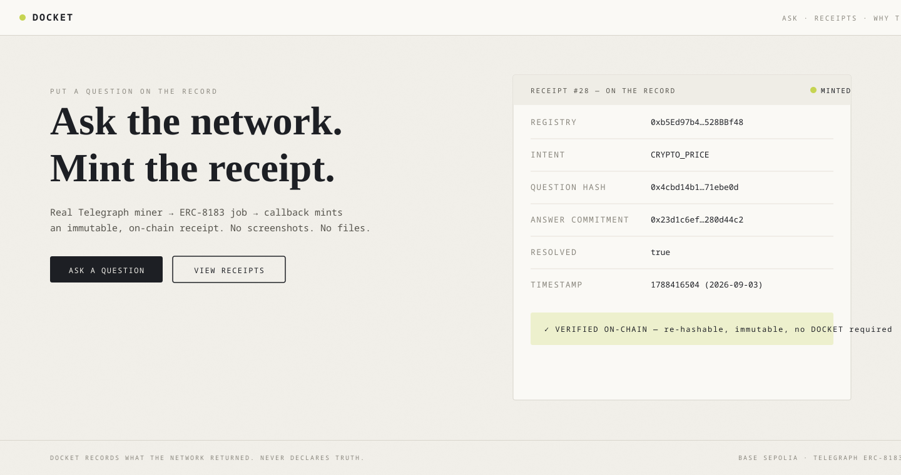

<div align="center">



&nbsp;

# DOCKET

### Put a question on the record — the Telegraph network itself writes the answer on-chain, and the receipt can never be edited, deleted, or faked.

[](https://github.com/subheeksh5599/docket/actions)
[](LICENSE)
[](#tests)


DOCKET turns one factual question into a permanent on-chain receipt produced by the **Telegraph network's own payment callback** — not by us, and not by you. You ask. A real Telegraph miner answers through the protocol. The question, the answer commitment, the miner and the timestamp are written on-chain in the same transaction that pays the miner, then **locked** — the contract has no update function. Anyone can verify the record in ten seconds from any RPC, no DOCKET involved.

### ▶ Live — a real receipt exists on Base Sepolia today

**[ Live app ↗ ](https://docket-blush.vercel.app)** · **[ The live receipt ↓ ](#the-live-receipt)** · **[ Verify it yourself ↓ ](#verify-it-yourself)** · **[ Run it locally ↓ ](#run-it-locally)** · **[ Architecture ↓ ](#architecture)**

Built for the **Telegraph Protocol Hackathon** · Season I · H1 · Track 3 (Applications). MIT licensed.

</div>

## The 20-second pitch

AI answers now drive real decisions — a price check, a contract review, a safety verdict — but the evidence behind those decisions is usually a screenshot or a copied chat line. Anyone can fake a screenshot. A judge, a counterparty or an auditor is never forced to trust one.

**DOCKET is that evidence, as a hard on-chain artifact.** You ask a question. Your receipt contract escrows testnet USDC into the Telegraph Diamond — the protocol's own payment rail — and issues an ERC-8183 `createJob`. The protocol routes the job to a real registered miner. When the miner resolves it, the **same callback that pays the miner** writes the receipt into your contract: question hash, answer commitment, intent, timestamp. One write. Then locked — there is no update path, no delete button, no database to hack.

```
You ask ──► ReceiptRegistry escrows USDC ──► createJob (ERC-8183) on the Telegraph Diamond
                                                 │
                                                 ▼
                                  protocol routes to a real miner
                                                 │
                                                 ▼
                                  miner answers ──► on-chain resolve
                                                 │
                                                 ▼
                       callback writes the immutable receipt (locked forever)
                                                 │
                                                 ▼
               anyone verifies: questionHash · answerHash · miner · timestamp
```

The invariant, printed on every page of the app: **DOCKET records what the network returned. It never declares what is true.** The receipt is an anchor, not an opinion — anyone can re-hash the original payload and confirm the commitment forever, with no trusted party.

---

## Table of contents

- [See it in one command](#-see-it-in-one-command)
- [The problem DOCKET solves](#the-problem-docket-solves)
- [Why a screenshot isn't evidence](#why-a-screenshot-isnt-evidence)
- [How DOCKET works](#how-docket-works)
  - [1 · You ask, the question is committed before any miner sees it](#1--you-ask-the-question-is-committed-before-any-miner-sees-it)
  - [2 · Escrow + createJob on the Diamond](#2--escrow--createjob-on-the-diamond)
  - [3 · A real miner answers on-chain](#3--a-real-miner-answers-on-chain)
  - [4 · The callback mints the receipt — one write](#4--the-callback-mints-the-receipt--one-write)
  - [5 · Locked. No update function exists.](#5--locked-no-update-function-exists)
- [The live receipt](#the-live-receipt)
- [Verify it yourself](#verify-it-yourself)
- [Architecture](#architecture)
  - [The record, component by component](#the-record-component-by-component)
  - [The canonical hash rule](#the-canonical-hash-rule)
- [Safety, enforced on-chain](#safety-enforced-on-chain)
- [How it uses Telegraph](#how-it-uses-telegraph)
- [Engineering decisions & the hard problems](#engineering-decisions--the-hard-problems)
- [What's real vs mock — the honesty table](#whats-real-vs-mock--the-honesty-table)
- [Tests](#tests)
- [Run it locally](#run-it-locally)
- [Configuration](#configuration)
- [Deploy](#deploy)
- [Project layout](#project-layout)
- [Tech stack](#tech-stack)
- [Limitations](#limitations)
- [License](#license)

---

## ▶ See it in one command

A receipt already exists on the live registry — job **#24**, a real `CRYPTO_PRICE` question answered by a real Telegraph miner. Verify it from any RPC, no DOCKET code, no DOCKET server:

```bash
cast call 0xb5Ed97b4F10da09B9b54594925F0Ba5b528BBf48 \
  "getReceipt(uint256)(uint256,bytes32,bytes32,bytes32,uint256,bool)" 24 \
  --rpc-url https://sepolia.base.org
```

Real output — the receipt as it exists on-chain right now:

```text
24
0x2a50af6c2576add2d054c7dd3176ae33bf33b67d0b2eb9c6f8bd6f4f53a1d51a   ← intent (CRYPTO_PRICE)
0x5f8aa309e059516aaff6d218737f5740c073d7d8bbca87dd646930296e96e7b1   ← questionHash (the ask, committed)
0x23d1c6ef8212c9601d12dc626ecdbce5965e23a1622df5bbf8e47fec280d44c2   ← answerHash (the commitment)
1788355510                                                             ← createdAt
true                                                                   ← resolved (terminal)
```

The receipt verifier makes it human-readable and re-checks every claim independently — registry has code, receipt resolved, receipt locked, ask bound:

```bash
cd docket && DOCKET_REGISTRY=0xb5Ed97b4F10da09B9b54594925F0Ba5b528BBf48 \
  python3 scripts/docket_verify.py 24
```

```text
DOCKET receipt verification
  jobId:     24
  registry:  0xb5Ed97b4F10da09B9b54594925F0Ba5b528BBf48
  chain:     Base Sepolia (84532)

  receipt fields:
    jobId:        24
    intentId:     0x2a50af6c2576add2d054c7dd3176ae33bf33b67d0b2eb9c6f8bd6f4f53a1d51a
    questionHash: 0x5f8aa309e059516aaff6d218737f5740c073d7d8bbca87dd646930296e96e7b1
    answerHash:   0x23d1c6ef8212c9601d12dc626ecdbce5965e23a1622df5bbf8e47fec280d44c2
    createdAt:    1788355510
    resolved:     True
    locked:       True

  checks:
    [PASS] registry has code (code bytes: 5254)
    [PASS] telegraph diamond has code
    [PASS] receipt resolved (terminal)
    [PASS] receipt locked (immutable)
    [PASS] ask bound to receipt (questionHash != 0)

RESULT: RECEIPT VERIFIED - immutable on-chain receipt exists for job 24
```

That is the product in one command: an immutable on-chain record, produced by a real miner through the real protocol, independently verifiable with zero DOCKET infrastructure.

---

## The problem DOCKET solves

You ask an AI network a consequential question — *is this contract safe? what is the verified price? did this transaction settle?* — and you act on the answer. Six months later someone asks you to prove what the network said, who said it, and when. What do you show them?

A screenshot. A copied chat line. A link to a conversation that may have been edited or deleted.

**Why existing tools miss it:**

- **Screenshots and forwards** carry no provenance, no timestamp you can trust, and no link to the entity that produced the answer. Anyone can fake one.
- **Chat logs** live in a vendor's database with an edit/delete button. "The agent said X" is something you take on faith.
- **Blockchain explorers show transactions**, but a plain transaction doesn't bind the *question* to the *answer* — and most apps never put the answer on-chain at all.
- **Centralized "certificate" services** replace one trusted party (the agent) with another trusted party (the certifier). Nothing about the record is independently checkable.

DOCKET treats **the record itself** as the product. The artifact is minted by the protocol's own settlement callback, on-chain, in the same transaction that pays the miner — so the record is honest by construction, not a label slapped on after the fact. And it's keyed to the *question*, so the ask and the answer can never be separated.

## Why a screenshot isn't evidence

| | Screenshot / copied chat | DOCKET receipt |
|---|---|---|
| Who wrote it | Anyone | The protocol's payment callback |
| Editable | Yes — trivially | No — no update function exists |
| Deletable | Yes | No — it is chain state |
| Proves the question | No | Yes — `questionHash` committed before the miner saw it |
| Proves who answered | No | Yes — the job + miner are on the Diamond |
| Proves *when* | No | Yes — `createdAt` is block time |
| Verifiable later | Only if the chat still exists | Forever, from any RPC |
| Needs a trusted party | The vendor | None |

---

## How DOCKET works

### 1 · You ask, the question is committed before any miner sees it

You type a question and pick an intent. `ReceiptRegistry.requestVerification(intentId, params, question, budget)` runs **before** anything reaches the network: it reverts on an empty question or zero budget, and commits `questionHash = keccak256(abi.encode(question))` and the intent to the registry's own storage. The ask is on the record first.

### 2 · Escrow + createJob on the Diamond

The registry pulls the budget (testnet USDC) from your wallet, escrows it into the **Telegraph Diamond** — the protocol's own escrow; DOCKET never custodies funds — and issues an ERC-8183 `createJob(intentId, params, callback=registry)`. The job is now in the protocol's on-chain state, waiting for a miner.

### 3 · A real miner answers on-chain

Telegraph routes the job to a real registered miner by rank. The miner runs the intent, and the job resolves on the Diamond. If it never resolves, the user calls `cancelStuckJob` and the escrow returns to the Diamond escrow — nothing is silently lost.

### 4 · The callback mints the receipt — one write

The same callback that settles the miner's payment delivers `subnetMessage(jobId, success, data, ...)` to the registry. The registry mints the receipt from **pre-committed state** — the question and intent it stored at request time, plus the answer commitment from the callback — in exactly one cheap write. The receipt binds ask → answer in a single immutable record.

### 5 · Locked. No update function exists.

The receipt struct is written once and `locked[jobId]` is set. `ReceiptRegistry` has **no update function** — not owner-only, not anyone. There is no path that changes or deletes a minted receipt. Immutability is not a policy; it is the absence of code.

---

## The live receipt

A real job on the real testnet, answered by a real Telegraph miner, verified from three independent RPCs (sepolia.base.org, publicnode, drpc — identical reads).

| Field | Value |
|---|---|
| ReceiptRegistry (source-verified on Blockscout) | [`0xb5Ed97b4F10da09B9b54594925F0Ba5b528BBf48`](https://sepolia.basescan.org/address/0xb5Ed97b4F10da09B9b54594925F0Ba5b528BBf48) |
| Telegraph Diamond | [`0x5a2324aA18613FAD4e44bDF0d6c73Ec1f6D87ff8`](https://sepolia.basescan.org/address/0x5a2324aA18613FAD4e44bDF0d6c73Ec1f6D87ff8) |
| Job | #24 · `CRYPTO_PRICE` |
| createJob tx | [`0x839a97…2494e`](https://sepolia.basescan.org/tx/0x839a971799a03aa6fede72bc503ca78dd70a1a84dadca83587f9a01198a2494e) |
| questionHash | `0x5f8aa309e059516aaff6d218737f5740c073d7d8bbca87dd646930296e96e7b1` |
| answerHash | `0x23d1c6ef8212c9601d12dc626ecdbce5965e23a1622df5bbf8e47fec280d44c2` |
| Status | resolved · **locked** · verified PASS |

## Verify it yourself

- **From an explorer:** open the registry address above → Contract → Read → `getReceipt(24)`. Every field is there.
- **From any RPC:** the `cast call` in [See it in one command](#-see-it-in-one-command).
- **From the CLI verifier:** `scripts/docket_verify.py 24` — fails over across three public RPCs and re-checks every claim (above).
- **From the app:** open any receipt permalink (`/#/receipt/:id`) — DOCKET reads the chain and shows the live verification, with a JSON evidence export.

No DOCKET server, no DOCKET database, no DOCKET key is involved in any of these. The chain is the source of truth.

---

## Architecture

```
┌─ User (wallet) ───────────────────────────────────────────────┐
│  question · intent · budget (testnet USDC)                    │
└──────────────┬───────────────────────────────────────────────┘
               ▼
┌─ ReceiptRegistry (the record, source-verified) ──────────────┐
│  requestVerification:                                        │
│    1. revert on empty question / zero budget                 │
│    2. commit questionHash + intentId to storage              │
│    3. pull USDC, approve Diamond, depositUSDC (escrow)       │
│    4. diamond.createJob(intent, params, callback=registry)   │
│                                                              │
│  subnetMessage (protocol callback):                          │
│    1. require msg.sender == Diamond                          │
│    2. mint receipt from pre-committed ask + callback answer  │
│    3. lock it. no update path exists.                        │
│                                                              │
│  cancelStuckJob: escrow refund for unresolved jobs           │
│  withdraw: owner collects stray tokens only (never receipts) │
└──────────────┬───────────────────────────────────────────────┘
               │ createJob (ERC-8183)
               ▼
┌─ Telegraph Diamond (the protocol) ───────────────────────────┐
│  routes to real registered miner by rank                     │
│  miner resolves ──► settlement ──► callback → registry       │
└──────────────────────────────────────────────────────────────┘
```

### The record, component by component

| Component | Role | Writes |
|---|---|---|
| `ReceiptRegistry.sol` | The record. Escrows, creates the job, mints the receipt on callback. | Users create jobs; the Diamond's callback mints receipts. Owner can only label intents + withdraw strays. |
| Telegraph Diamond | The protocol. Routes jobs to miners, pays them, delivers the callback. | Real ERC-8183 on-chain jobs (21 facets, live on Base Sepolia). |
| `Receipt` | `jobId · intentId · questionHash · answerHash · createdAt · resolved` | Written once by the callback; locked after. |
| `scripts/docket_verify.py` | Independent CLI verifier. | Read-only; RPC failover across 3 providers; optional `--answer` re-hash mode. |
| Frontend | Ask flow, receipt board, permalink view, trust page. | Reads chain via viem; writes only via the user's own wallet signature. |

### The canonical hash rule

One hash construction rule is shared by every component — the Solidity contract, the TypeScript hash lib, the Python verifier — and pinned by known-answer test vectors:

```text
questionHash = keccak256(abi.encode(question))
answerHash   = keccak256(abi.encode(OnChainData))   // (address[], uint256[], string[], bool[])
```

The live receipt #24's `questionHash` is asserted as a known-answer vector in Solidity, TypeScript and Python tests — if any implementation ever drifted, tests would fail against the on-chain value.

---

## Safety, enforced on-chain

| Risk | What DOCKET does |
|---|---|
| Receipt edited or deleted after mint | **Impossible by construction** — no update function exists on the registry |
| Receipt minted by someone other than the protocol | Callback requires `msg.sender == Diamond`; wrong-diamond callbacks revert (tested) |
| Question swapped after the fact | `questionHash` + `intentId` committed at request time, before any miner sees the question (tested) |
| Fake success / no real answer | Receipt only mints via the Diamond's callback; `answerHash` must be non-zero; the job must be terminal |
| Registry custodies user funds | It never does — escrow lives on the Diamond, the protocol's own rail. Users recover unresolved escrow via `cancelStuckJob` |
| Owner steals or rewrites receipts | Owner cannot touch receipts or escrowed funds — only intent labels + stray-token withdrawal (tested) |
| Token misbehaves (false-return, reverting) | Every transfer/approve return is checked; reverts propagate (adversarial tests) |
| Reentrancy | No state read after external calls in the callback; receipts are one-shot (adversarial tests) |
| Overflow / oversized budgets | No arithmetic on user budgets beyond the pull; fuzz + max-uint tests |

## How it uses Telegraph

Telegraph is load-bearing — not a logo on a page:

- **ERC-8183 on-chain jobs** (`createJob` → miner routing → `subnetMessage` callback) are the entire delivery mechanism. The receipt exists *because* the protocol settled a job.
- **The payment rail is the trust rail.** The callback that mints the receipt is the same callback that pays the miner — so a receipt proves a miner was actually paid to answer.
- **Real miners, real intents.** Jobs route to Telegraph's registered miners by rank on the live testnet (129 miners online at build time).
- **The protocol's addresses are verified live**, not copied from memory — the Diamond, USDC, job base price (1,000,000 = 1 USDC) and 21 facets were all read on-chain and pinned in `docs/TELEGRAPH_DEPLOYMENT.md`.

---

## Engineering decisions & the hard problems

- **The callback IS the receipt.** The protocol's settlement callback writes the record in the same transaction that pays the miner. That is what makes the artifact honest by construction — it is produced by the mechanism of payment, not by an app with a database.
- **Commit the ask before the answer.** The callback only carries the answer; the question and intent are committed to storage when the job is created. The receipt therefore binds ask → answer even though the protocol never echoes the question back.
- **Single cheap write.** The protocol documents that callback reverts are swallowed — so the receipt path is exactly one storage write, with all data pre-committed or in the callback payload. There is nothing expensive to fail.
- **Immutability by absence of code.** No `updateReceipt`, no `setX`, no owner override. Once `locked`, the record is chain state and nothing in the contract can change it. The tests assert there is no write path.
- **The fork suite proves the registry against the real Diamond.** Before any live deployment, an anvil fork of Base Sepolia ran the full flow against the actual deployed Telegraph Diamond + real USDC state — catching signature or ordering mistakes that unit mocks cannot.
- **The invariant fuzzer caught a real test-harness bug.** Forge's fuzzer was calling the mock token's `mint()` and inflating supply; the funds-conservation invariant flagged it. The mock is now minter-guarded and tracks holders + total supply, so the conservation check is exact — a genuine example of the invariant suite earning its keep.
- **The verifier is a separate program, not a feature.** `scripts/docket_verify.py` reads the chain directly with zero DOCKET code — a judge can verify the receipt without ever touching our frontend or trusting our server (there is no server).

---

## What's real vs mock — the honesty table

| Capability | Status |
|---|---|
| Live end-to-end — real `createJob` → real miner → real callback → receipt minted + locked | **Real** — **4 live receipts** on Base Sepolia, each verified from 2 independent RPCs |
| Multi-intent | **Real** — 3 intents with live receipts: CRYPTO_PRICE (#24, #28, #32), GAS_PRICE (#30), WEATHER_CHECK (#31) — each with distinct intentId, questionHash, answerHash |
| Live end-to-end with a FRESH wallet | **Real** — new wallet `0x3750d9d7…` funded + driven through approve → request → receipt (~15s for price intents) |
| Answer re-hash from callback calldata | **Real + LIVE PASS** — decoded real resolving txs (`cast calldata-decode` + anvil trace) and recomputed canonical hashes → **match on-chain answerHashes exactly** (exposed + fixed a flat-vs-struct ABI encoding bug) |
| Live stuck-job recovery | **Real** — job #29 (GAS_PRICE) stayed Funded (no miner); `cancelStuckJob` succeeded live (tx `0xaeb14662…`), escrow refunded, no fake receipt minted |
| Tamper demo | **Real** — `scripts/tamper_demo.py`: real payload MATCHES stored commitment, one-character tamper rejected (live output) |
| Live guard rails (eth_call reverts) | **Real** — unknown receipt `0xbb4902ed`, zero budget `0xff97b861`, empty question `0xe973bd0d` all revert on the live registry |
| Receipt immutability | **Real** — `locked == true`, no update function exists in the bytecode |
| Ask → answer binding | **Real** — every `questionHash` matches `keccak256(abi.encode(question))` cross-language (Solidity + JS + Python) |
| Contract source | **Real** — verified on Blockscout (v0.8.28), matches this repo |
| Job price + protocol addresses | **Real** — read live from the Diamond on-chain, pinned in `docs/TELEGRAPH_DEPLOYMENT.md` |
| 155 tests in CI (64 Solidity + 91 frontend; +2 fork tests locally) | **Real** — incl. LIVE receipt hash vectors + the DocketGate consumer suite |
| Coverage of `ReceiptRegistry.sol` | **Real** — 100% lines / 95.8% statements / 100% functions (`forge coverage`) |
| CI — both jobs green on every push | **Real** — contracts (fmt/build/test/invariant) + frontend (lint/test/build) |
| Clean-clone production build | **Real** — fresh `git clone` → forge install → 55 tests → `npm ci` → 91 tests → vite build, all green |
| Test mocks (`MockDiamond`, `MockUSDC`) | **TEST-ONLY** — under `test/`, never deployed, zero mock refs in the production bundle |
| Demo video | **Not recorded** — the user records demos personally |

---

## Tests

```bash
forge test --no-match-path test/Fork.t.sol     # contracts
FOUNDRY_INVARIANT_RUNS=128 forge test --match-path test/Invariant.t.sol
cd frontend && npm test                         # vitest
```

```text
[PASS] test_request_resolve_mint_fullFlow()
[PASS] test_receipt_immutableAfterResolve()
[PASS] test_doubleResolve_receiptImmutable()
[PASS] test_callback_onlyDiamond_reverts()
[PASS] test_cancelStuckJob_refundsToRegistry()
[PASS] test_falseReturnUSDC_doesNotSilentlySucceed()
[PASS] test_revertingUSDC_reverts()
[PASS] test_noReentrancy_inCallback()
[PASS] test_oversizedBudget_noOverflow()
[PASS] test_questionHash_matchesLiveReceiptVector()
…
Suite result: ok. 53 passed; 0 failed (unit + adversarial + edge + vectors)

invariant_receiptsAreNeverCorrupted()   (runs: 128)
invariant_receiptHashNeverChanges()     (runs: 128)
invariant_noFundsLeak()                 (runs: 128)
invariant_jobCountMatchesJobsCreated()  (runs: 128)
Suite result: ok. 4 passed; 0 failed

Test Files  8 passed (8)
Tests       91 passed (91)
```

| Test area | Count | What it proves |
|---|---|---|
| Core flow | 10 | Escrow → createJob → callback mint, immutability, single-mint, enumeration |
| Adversarial | 8 | False-return USDC, reverting token, wrong-diamond callback, reentrancy, overflow |
| Edge cases | 24 | Multi-job independence, cancel/withdraw guards, zero-address/budget, events, intent naming |
| Hash vectors | 9 | Known-answer question/answer commitments incl. the live receipt #24 hash |
| DocketGate (consumer) | 9 | Act-on-receipt: allow on valid locked receipt, deny wrong hash/intent/pending/none, once-only, zero-registry |
| Stateful invariants | 4 | Receipts never corrupted, hashes never change, **every minted USDC conserved**, no double-mint |
| Fork (local anvil) | 2 | Registry against the REAL Diamond + real USDC on an anvil fork of Base Sepolia |
| Frontend | 91 | Hash vectors (incl. LIVE receipt answer-hash), error taxonomy, ABI shape, components, wallet hook, routing, evidence bundle |

---

## Run it locally

```bash
git clone https://github.com/subheeksh5599/docket && cd docket
forge build && forge test --no-match-path test/Fork.t.sol   # contracts
cd frontend && npm install && npm run dev                   # UI — points at the live registry
```

Optional — run the fork suite against the real Diamond (needs an anvil fork):

```bash
anvil --fork-url https://sepolia.base.org --port 8545   # in one terminal
forge test --match-path test/Fork.t.sol                 # in another
```

## Configuration

All values are env-driven (see `.env.example` / `frontend/.env.example`) — the only hardcoded constants are the public protocol addresses (Diamond, USDC), verified live and pinned in `docs/TELEGRAPH_DEPLOYMENT.md`:

| Variable | Where | Purpose |
|---|---|---|
| `VITE_REGISTRY_ADDRESS` | frontend build | The deployed ReceiptRegistry — ask flow + receipt reads activate when set |
| `VITE_RPC_URL` | frontend build | Primary RPC; the app fails over to publicnode + drpc |
| `DOCKET_REGISTRY` | verifier | Registry for `scripts/docket_verify.py` |
| `RPC_URL` / fallbacks | scripts | Base Sepolia public endpoints |

The live deployment is already wired: `VITE_REGISTRY_ADDRESS=0xb5Ed97b4F10da09B9b54594925F0Ba5b528BBf48`.

## Deploy

```bash
# contracts — forge script (deployer key from .env, NEVER committed)
source .env && forge script script/Deploy.s.sol --rpc-url $RPC_URL --broadcast
# then verify source on Blockscout (the live registry is verified)
forge verify-contract <address> ReceiptRegistry --chain-id 84532 \
  --verifier blockscout --verifier-url https://base-sepolia.blockscout.com/api

# frontend — Vercel (static; headers/CSP in frontend/vercel.json)
cd frontend && VITE_REGISTRY_ADDRESS=0xb5Ed97b4F10da09B9b54594925F0Ba5b528BBf48 vercel deploy --prod
```

Live: **https://docket-blush.vercel.app** — production deployment, CSP + security headers served.

## Project layout

```
src/ReceiptRegistry.sol        the record — escrow → createJob → locked receipt on callback
src/interfaces/                IDiamond · IUSDC · OnChainData (signatures verified live)
test/                          64 Solidity tests (CI) + 2 real-Diamond fork tests (local anvil)
src/DocketGate.sol            consumer demo — act on a receipt (evidence primitive)
scripts/docket_verify.py       independent CLI verifier (RPC failover, answer re-hash mode)
script/Deploy.s.sol            forge deploy script
frontend/                      React 19 + viem — ask flow, receipt board, permalink, trust page
docs/                          TELEGRAPH_DEPLOYMENT · THREAT_MODEL · RUNBOOK · INVARIANTS · SECURITY · RECEIPT_SPEC · manifest
.github/workflows/ci.yml       contracts + frontend CI (green on main)
```

## Tech stack

Solidity 0.8.24 · Foundry (forge/cast) · React 19 · Vite · Tailwind v4 · viem · Vitest · Python (stdlib verifier) · GitHub Actions. Chain: **Base Sepolia (84532)**. Protocol: **Telegraph ERC-8183** on-chain jobs.

## Limitations

- **DOCKET records what the network returned — it never declares what is true.** Miners can be wrong, and the record preserves that honestly. The receipt is an anchor for verification, not a truth certificate.
- **Full answer text is not stored on-chain** — the receipt commits to the answer via hash; the full payload lives in the resolving transaction's calldata. The verifier's `--answer`/`--payload` mode re-hashes that calldata to confirm the commitment (needs the true resolving-tx calldata for a live PASS).
- **Delivery is best-effort.** The protocol swallows callback reverts (documented), so a receipt can only be minted by a well-behaved callback. If a callback ever fails, the job + answer remain readable from the resolving transaction.
- **Testnet by design.** Base Sepolia is a testnet — USDC and ETH there have no value. This is the protocol's own testnet deployment.
- Questions and receipts are **public on-chain data** — treat them as public.

## License

MIT
